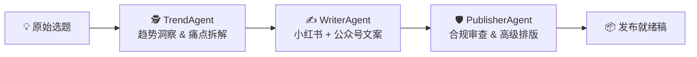

# 🤖 AI 自媒体矩阵全自动运营官

<div align="center">

**Multi-Agent Content Command Center — 从选题到发布，全流程自动化。**

[](https://www.python.org/)
[](https://streamlit.io/)
[](https://docs.pydantic.dev/)
[](LICENSE)

</div>

---

## 📖 简介

一个基于 **DeepSeek** 大模型的 Python 多智能体系统，把一个原始自媒体选题变成可直接发布的多平台内容。三位 Agent 像成熟内容中台一样接力协作：先拆爆款视角 → 再生成多平台文案 → 最后完成合规审查与高级排版。



## ✨ 功能亮点

| 智能体 | 职责 | 输出 |
|---|---|---|
| 🕵️ **TrendAgent** | 趋势雷达 — 拆解真实痛点、提炼爆款切入视角、扩展搜索关键词 | 3 个爆款视角 + 5 个关键词 |
| ✍️ **WriterAgent** | 爆款主笔 — 小红书震惊体/悬念体 + 公众号深度长文，双平台文风自适应 | 标题 + 正文（双平台） |
| 🛡️ **PublisherAgent** | 总编审校 — 合规风险词审查 + 莫兰迪配色高级 HTML 排版 | Markdown + 精美手机端预览 HTML |

- ✅ **结构化输出**：Pydantic 模型约束 LLM 响应，告别 JSON 解析错误
- ✅ **双界面**：CLI 命令行 + Streamlit Web UI，适合调试也适合演示
- ✅ **手机端预览**：公众号排版以手机框效果实时预览
- ✅ **风险兜底**：自动识别广告法违禁词、平台敏感词，标记需人工复核的内容

## 🧬 架构详解

### 核心基座

整个系统建立在三个可组合的抽象之上：

```
BaseAgent (ABC)  →  DeepSeekClient  →  Pydantic Model (JSON Schema)
     ↑                    ↑                    ↑
  约定生命周期         OpenAI 兼容调用        结构化约束
```

#### 1. BaseAgent — Agent 生命周期

[`base.py`](src/media_matrix/agents/base.py) 只做两件事：

1. **自动装配 LLM 客户端**：`__init__` 中创建 `DeepSeekClient()` 实例挂到 `self.llm_client`，子类无需关心连接细节。
2. **约定 `process` 接口**：子类只需实现 `process(self, state) -> State`，从 `state` 中读取上游产出，写入自己的结果，更新 `current_step` 后返回。

```python
class TrendAgent(BaseAgent):
    def process(self, state: AgentState) -> AgentState:
        # 1. 读取 state.topic
        # 2. 构建 system_prompt + user_prompt
        # 3. 调用 self.llm_client.request_structured(...)
        # 4. 写入 state.trend_result，更新 state.current_step
        return state
```

#### 2. DeepSeekClient — 结构化 LLM 调用

[`client.py`](src/media_matrix/client.py) 封装了从环境变量加载到结构化输出的完整链路：

| 步骤 | 说明 |
|---|---|
| `load_dotenv()` | 自动读取项目根目录 `.env` 并注入 `os.environ` |
| `OpenAI(base_url=...)` | 用 OpenAI Python SDK 对接 DeepSeek 兼容接口 |
| `request_structured()` | 将 Pydantic `model_json_schema()` 注入 system prompt，调用 `response_format="json_object"`，响应用 `model_validate_json()` 做运行时校验 |

> **关键设计**：system prompt 末尾动态拼接了 JSON Schema，LLM 在生成时就知道目标结构。响应回来后再经过 Pydantic 校验层兜底——即使模型输出格式有瑕疵也能尽早发现。

```python
# 调用方式（Agent 内部）
result = self.llm_client.request_structured(
    system_prompt="你是千万级网红背后的幕后操盘手...",
    user_prompt=f"请分析：{state.topic}",
    response_model=TrendAnalysis,  # ← Pydantic 模型
)
# result 是类型安全的 TrendAnalysis 实例
```

#### 3. State — 单一数据总线

[`state.py`](src/media_matrix/state.py) 用 Pydantic + dataclass 定义了一条贯穿全流程的数据总线 `State`：

```
State.original_topic           ← 用户输入
State.trend_result             ← TrendAgent 写入
State.content_result           ← WriterAgent 写入
State.publisher_result         ← PublisherAgent 写入
State.current_step             ← 每个 Agent 更新流水线状态
```

每个 Agent 只读写自己负责的字段，通过 `current_step` 标记成功/失败/跳过，下游据此判断是否继续。这种设计让 Agent 之间零耦合——新增 Agent 只需读写 `State` 上的新字段，不碰任何已有代码。

---

### 各 Agent 内部拆解

#### 🕵️ TrendAgent — 趋势洞察

**文件**: [`trend_agent.py`](src/media_matrix/agents/trend_agent.py)

**输入 / 输出**:

| 输入 | 输出 |
|---|---|
| `state.topic`（原始选题字符串） | `state.trend_result: TrendAnalysis` |

**Pydantic 输出模型**:

```python
class TrendAnalysis(BaseModel):
    pain_points: list[str]          # 用户真实痛点
    angles: list[str]               # 3 个爆款切入视角
    keywords: list[str]             # 5 个扩展关键词
```

**System Prompt 核心设计**:

角色定位为「千万级网红背后的幕后操盘手 + 爆款趋势分析师」，让模型从高情绪价值、高讨论度、高转发欲三个维度切题。Prompt 只描述角色和方法论，具体选题通过 `user_prompt` 注入。

**执行流程**:

1. 组装 system prompt（角色 + 任务描述）+ user prompt（选题原文）
2. 调用 `request_structured(system, user, TrendAnalysis)` → DeepSeek 返回严格 JSON
3. Pydantic 自动校验 `min_length=3`（angles）和 `min_length=5`（keywords）
4. 写入 `state.trend_result`，标记 `current_step = "trend_analyzed"`
5. 失败时捕获异常，标记 `current_step = "trend_failed"`

---

#### ✍️ WriterAgent — 多平台文案生成

**文件**: [`writer_agent.py`](src/media_matrix/agents/writer_agent.py)

**输入 / 输出**:

| 输入 | 输出 |
|---|---|
| `state.topic` + `state.trend_result` | `state.content_result: CopywriteOutput` |

**防御性检查**：若上游 TrendAgent 未产出（`state.trend_result is None`），直接标记 `writer_skipped` 并返回，不做无效调用。

**Pydantic 输出模型**:

```python
class CopywriteOutput(BaseModel):
    xiaohongshu_title: str      # 小红书标题
    xiaohongshu_content: str    # 小红书正文
    wechat_title: str           # 公众号标题
    wechat_content: str         # 公众号正文
```

**System Prompt 核心设计**:

Prompt 明确划分两套文风规格——

- **小红书**：震惊体/悬念体标题（"救命！…""狠狠搞懂…"）、短句分段、大量 Emoji、结尾带 #标签
- **公众号**：理性克制标题、逻辑严密的分段结构（一/二/三）、深度观点 + 行动建议

**user_prompt 信息密度**：将上游 TrendAgent 拆解出的 `pain_points`、`angles`、`keywords` 全部注入，保证文案紧贴趋势分析。

**执行流程**:

1. 校验 `state.trend_result` 存在性
2. 将痛点 + 视角 + 关键词拼接进 user_prompt
3. 调用 `request_structured(system, user, CopywriteOutput)` 一次生成双平台文案
4. 写入 `state.content_result`，标记 `content_generated`

---

#### 🛡️ PublisherAgent — 合规审查 + 高级排版

**文件**: [`publisher_agent.py`](src/media_matrix/agents/publisher_agent.py)

这是三个 Agent 中逻辑最重的一个，承担**审校 + 格式化**双重职责。

**输入 / 输出**:

| 输入 | 输出 |
|---|---|
| `state.topic` + `state.content_result` | `state.publisher_result: PublisherOutput` |

**Pydantic 输出模型**:

```python
class PublisherOutput(BaseModel):
    is_safe: bool                   # 是否通过合规审查
    risk_reason: Optional[str]      # 风险原因（不安全时）
    xiaohongshu_markdown: str       # 格式化后的小红书 Markdown
    wechat_html: str                # 精美 CSS 排版的公众号 HTML
```

**System Prompt 三层结构**:

| 阶段 | 任务 | 细节 |
|---|---|---|
| **审查层** | 合规风险词扫描 | 政治/暴恐/色情/歧视/违规承诺，广告法高危词（"绝对""第一""最强""保证""包过"） |
| **格式化层** | 小红书 Markdown | 保留 Emoji + 短句节奏 + 空行分段 + #标签，适配手机阅读 |
| **排版层** | 公众号 HTML | 完整 CSS 内联样式、莫兰迪配色系统、卡片式 blockquote、border-left 标题装饰 |

排版规范精确到色值和像素：

| 元素 | 样式 |
|---|---|
| 页面背景 | `#F4EFEA`（淡奶茶色） |
| 主色调 | `#8A9A86`（高级灰绿） |
| 正文 | `#333333`, `font-size: 16px`, `line-height: 1.75` |
| 金句 blockquote | `box-shadow` + `border-radius: 8px` + 浅色背景卡片 |
| 标题 | `border-left: 5px solid #8A9A86` |

**执行流程**:

1. 校验 `state.content_result` 存在性
2. 将双平台原文全部注入 user_prompt
3. 一次 LLM 调用完成审查 + 格式转换 + HTML 排版
4. 根据 `is_safe` 更新 `review_status`（`approved` / `needs_review`）
5. 写入 `state.publisher_result`，标记 `publish_formatted`

---

## 🚀 快速开始

### 环境要求

- Python ≥ 3.11
- DeepSeek API Key（[获取地址](https://platform.deepseek.com/)）

### 安装

```bash
git clone git@github.com:Amorousdancer/media-matrix-agent.git
cd media-matrix-agent
pip install -e .
```

### 配置

在项目根目录创建 `.env` 文件：

```bash
DEEPSEEK_API_KEY=sk-your-key-here
DEEPSEEK_MODEL=deepseek-v4-pro
DEEPSEEK_TIMEOUT=120
DEEPSEEK_MAX_TOKENS=8192
```

> `.env` 已被 `.gitignore` 排除，不会误提交。

### CLI 运行

```bash
export PYTHONPATH="src"
python -m media_matrix.main
```

输出示例：

```
🚀 启动自媒体矩阵 Agent 管道，原始选题: '大模型时代的Vibe Coding...'

➔ 正在流经 Agent: TrendAgent...
✓ 当前管道状态: trend_analyzed

➔ 正在流经 Agent: WriterAgent...
✓ 当前管道状态: content_generated

➔ 正在流经 Agent: PublisherAgent...
✓ 当前管道状态: publish_formatted

🎉 全自动化内容矩阵生成成功 🎉
```

### Web UI 运行

```bash
streamlit run app.py
```

然后在浏览器打开 `http://localhost:8501`，在侧边栏填入 API Key，输入选题即可启动三 Agent 协作流水线。

## 📁 项目结构

```text
.
├── agent.md                  # Agent 项目上下文文档
├── app.py                    # Streamlit Web UI（精美版）
├── pyproject.toml            # 项目元数据与依赖
├── README.md                 # 本文件
└── src/
    └── media_matrix/
        ├── __init__.py
        ├── client.py         # DeepSeek LLM 客户端（OpenAI SDK 兼容）
        ├── main.py           # CLI 管线入口
        ├── state.py          # Pydantic 数据模型 & State 状态机
        ├── streamlit_app.py  # Streamlit UI（轻量版）
        └── agents/
            ├── __init__.py
            ├── base.py       # BaseAgent 抽象基类
            ├── trend_agent.py
            ├── writer_agent.py
            └── publisher_agent.py
```

## 🧠 技术栈

| 组件 | 技术选型 |
|---|---|
| LLM 服务 | DeepSeek (`deepseek-v4-pro`) |
| SDK | OpenAI Python SDK（兼容模式） |
| 结构化约束 | Pydantic ≥ 2.0 JSON Schema |
| Web UI | Streamlit ≥ 1.36 |
| 语言 | Python ≥ 3.11 |

## 🔧 可扩展性

Agent 体系设计为即插即用：

```python
class MyNewAgent(BaseAgent):
    def process(self, state: AgentState) -> AgentState:
        # 你的逻辑
        return state
```

然后在 `main.py` 的 `pipeline` 列表中加入即可：

```python
pipeline = [
    TrendAgent(),
    WriterAgent(),
    MyNewAgent(),  # ← 新 Agent
    PublisherAgent(),
]
```

规划中的扩展方向：
- **DesignerAgent** — 根据文案自动生成视觉/配图提示词
- **SchedulerAgent** — 对接平台 API 实现定时发布
- **AnalyticsAgent** — 发布后数据回收与分析闭环

## 📄 License

MIT

---

<div align="center">
Made with ❤️ by <a href="https://github.com/Amorousdancer">Amorousdancer</a>
</div>
