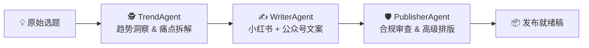

# 🤖 AI 自媒体矩阵全自动运营官

<div align="center">

**Multi-Agent Content Command Center — 从选题到发布，全流程自动化。**

[](https://www.python.org/)
[](https://streamlit.io/)
[](https://docs.pydantic.dev/)
[](LICENSE)

</div>

---

## 📖 简介

一个基于 **DeepSeek** 大模型的 Python 多智能体系统，把一个原始自媒体选题变成可直接发布的多平台内容。三位 Agent 像成熟内容中台一样接力协作：先拆爆款视角 → 再生成多平台文案 → 最后完成合规审查与高级排版。



## ✨ 功能亮点

| 智能体 | 职责 | 输出 |
|---|---|---|
| 🕵️ **TrendAgent** | 趋势雷达 — 拆解真实痛点、提炼爆款切入视角、扩展搜索关键词 | 3 个爆款视角 + 5 个关键词 |
| ✍️ **WriterAgent** | 爆款主笔 — 小红书震惊体/悬念体 + 公众号深度长文，双平台文风自适应 | 标题 + 正文（双平台） |
| 🛡️ **PublisherAgent** | 总编审校 — 合规风险词审查 + 莫兰迪配色高级 HTML 排版 | Markdown + 精美手机端预览 HTML |

- ✅ **结构化输出**：Pydantic 模型约束 LLM 响应，告别 JSON 解析错误
- ✅ **双界面**：CLI 命令行 + Streamlit Web UI，适合调试也适合演示
- ✅ **手机端预览**：公众号排版以手机框效果实时预览
- ✅ **风险兜底**：自动识别广告法违禁词、平台敏感词，标记需人工复核的内容

## 🚀 快速开始

### 环境要求

- Python ≥ 3.11
- DeepSeek API Key（[获取地址](https://platform.deepseek.com/)）

### 安装

```bash
git clone git@github.com:Amorousdancer/media-matrix-agent.git
cd media-matrix-agent
pip install -e .
```

### 配置

在项目根目录创建 `.env` 文件：

```bash
DEEPSEEK_API_KEY=sk-your-key-here
DEEPSEEK_MODEL=deepseek-v4-pro
DEEPSEEK_TIMEOUT=120
DEEPSEEK_MAX_TOKENS=8192
```

> `.env` 已被 `.gitignore` 排除，不会误提交。

### CLI 运行

```bash
export PYTHONPATH="src"
python -m media_matrix.main
```

输出示例：

```
🚀 启动自媒体矩阵 Agent 管道，原始选题: '大模型时代的Vibe Coding...'

➔ 正在流经 Agent: TrendAgent...
✓ 当前管道状态: trend_analyzed

➔ 正在流经 Agent: WriterAgent...
✓ 当前管道状态: content_generated

➔ 正在流经 Agent: PublisherAgent...
✓ 当前管道状态: publish_formatted

🎉 全自动化内容矩阵生成成功 🎉
```

### Web UI 运行

```bash
streamlit run app.py
```

然后在浏览器打开 `http://localhost:8501`，在侧边栏填入 API Key，输入选题即可启动三 Agent 协作流水线。

## 📁 项目结构

```text
.
├── agent.md                  # Agent 项目上下文文档
├── app.py                    # Streamlit Web UI（精美版）
├── pyproject.toml            # 项目元数据与依赖
├── README.md                 # 本文件
└── src/
    └── media_matrix/
        ├── __init__.py
        ├── client.py         # DeepSeek LLM 客户端（OpenAI SDK 兼容）
        ├── main.py           # CLI 管线入口
        ├── state.py          # Pydantic 数据模型 & State 状态机
        ├── streamlit_app.py  # Streamlit UI（轻量版）
        └── agents/
            ├── __init__.py
            ├── base.py       # BaseAgent 抽象基类
            ├── trend_agent.py
            ├── writer_agent.py
            └── publisher_agent.py
```

## 🧠 技术栈

| 组件 | 技术选型 |
|---|---|
| LLM 服务 | DeepSeek (`deepseek-v4-pro`) |
| SDK | OpenAI Python SDK（兼容模式） |
| 结构化约束 | Pydantic ≥ 2.0 JSON Schema |
| Web UI | Streamlit ≥ 1.36 |
| 语言 | Python ≥ 3.11 |

## 🔧 可扩展性

Agent 体系设计为即插即用：

```python
class MyNewAgent(BaseAgent):
    def process(self, state: AgentState) -> AgentState:
        # 你的逻辑
        return state
```

然后在 `main.py` 的 `pipeline` 列表中加入即可：

```python
pipeline = [
    TrendAgent(),
    WriterAgent(),
    MyNewAgent(),  # ← 新 Agent
    PublisherAgent(),
]
```

规划中的扩展方向：
- **DesignerAgent** — 根据文案自动生成视觉/配图提示词
- **SchedulerAgent** — 对接平台 API 实现定时发布
- **AnalyticsAgent** — 发布后数据回收与分析闭环

## 📄 License

MIT

---

<div align="center">
Made with ❤️ by <a href="https://github.com/Amorousdancer">Amorousdancer</a>
</div>
